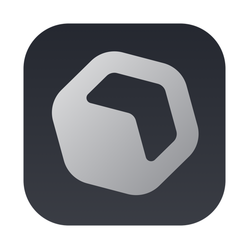

<p align="center">
  
</p>

<h1 align="center">Mactions</h1>

<p align="center">
  <strong>Ephemeral GitHub Actions runners from the Mac on your desk.</strong>
</p>

<p align="center">
  Mactions watches your repositories, starts a self-hosted runner only when a matching job queues, and tears that runner down after one job.
</p>

<p align="center">
  <a href="https://github.com/Kyter-com/Mactions/actions/workflows/release.yml"></a>
  <a href="https://github.com/Kyter-com/Mactions/actions/workflows/selfhosted-smoke.yml"></a>
  <a href="https://github.com/Kyter-com/Mactions/actions/workflows/win-smoke.yml"></a>
</p>

<p align="center">
  
  
  
  <a href="https://github.com/Kyter-com/Mactions/stargazers"></a>
  <a href="https://github.com/Kyter-com/Mactions/issues"></a>
  
</p>

## Why it exists

GitHub-hosted macOS and Windows ARM capacity can be unpredictable, and permanent
self-hosted runners are awkward for laptop-scale work. Mactions gives you a
native control plane for short-lived runners:

- **Scale from zero.** The normal idle state is no runner at all. Mactions polls
  queued jobs and provisions only when there is matching demand.
- **One job, then gone.** Every runner uses GitHub's ephemeral/JIT flow, runs a
  single job, deregisters, and is destroyed.
- **Mac-native fleet control.** Add repos, choose platforms, watch live runners,
  inspect job history, and view host memory from a SwiftUI dashboard.
- **Multi-OS from Apple Silicon.** Run macOS jobs on the host, Linux jobs in an
  arm64 Apple `container`, and Windows jobs in throwaway Win11 ARM VMware Fusion
  linked clones.
- **No always-on daemon.** If the app is offline or closed, it is not accepting
  work. That is the point.

## Status

Mactions is a working proof of concept, not a hardened CI product. It is useful
for trusted private repositories where you want local, on-demand runner capacity.

| Platform | Backend | State | Runner labels |
| --- | --- | --- | --- |
| macOS | Local process on the host Mac | Working; fastest path, no VM isolation | `[self-hosted, macOS, mactions]` |
| Linux | Apple `container`, arm64 | Proven end to end on 2026-06-08 | `[self-hosted, Linux, ARM64, mactions]` |
| Windows | VMware Fusion linked clone, Win11 ARM | Opt-in; proven end to end on 2026-06-01 | `[self-hosted, Windows, mactions]` |

Linux and Windows setup stay behind explicit buttons. Mactions will not download
a Windows image, build a VM, or pull the Linux runner image until you ask it to.

## Requirements

- macOS 13+ for the app. Apple Silicon is the target machine shape.
- Swift 6/Xcode for source builds.
- Apple `container` on macOS 26+ for Linux runners.
- VMware Fusion for Windows runners. Mactions uses Fusion's `vmrun` CLI and the
  bundled VMware Tools ISO during the Win11 ARM base build; Fusion itself is a
  manual install.
- Homebrew for the Windows media tools Mactions can install automatically:
  `aria2`, `cabextract`, `wimlib`, `cdrtools`, `minacle/chntpw/chntpw`, and
  `xorriso`.

## Quick Start

```bash
git clone https://github.com/Kyter-com/Mactions.git
cd Mactions
swift run Mactions
```

Then, in the app:

1. Connect GitHub with the GitHub CLI login, device flow, or a personal access
   token.
2. Add a repository, or enable "watch all repositories I can admin".
3. Choose the platforms that repo can use.
4. Click **Go online**.

Point a workflow at the labels you enabled:

```yaml
jobs:
  test:
    runs-on: [self-hosted, macOS, mactions]
    steps:
      - uses: actions/checkout@v4
      - run: swift test
```

Linux jobs must opt into ARM64:

```yaml
runs-on: [self-hosted, Linux, ARM64, mactions]
```

## How it works

1. Mactions polls GitHub for queued jobs in selected repositories.
2. Matching queued jobs become demand for a platform/label set.
3. Mactions asks GitHub for a JIT runner config.
4. The provider starts exactly one runner:
   - macOS: isolated per-run working directory on the host.
   - Linux: `ghcr.io/actions/actions-runner` inside a throwaway Apple
     `container`.
   - Windows: Win11 ARM linked clone from a prepared VMware Fusion base image.
5. The runner executes one job, deregisters, exits, and is cleaned up.
6. If more matching jobs remain queued, Mactions replaces it. Otherwise the
   fleet returns to zero.

## Security model

Treat Mactions as trusted-repo infrastructure.

- macOS jobs run on the host. The working directory and HOME are isolated per
  run, but this is not a sandbox.
- Linux jobs run in throwaway containers. The writable layer is discarded, but
  containers still share the host kernel.
- Windows jobs run in throwaway VMs, which is the strongest isolation currently
  shipped here.
- The GitHub token is stored in `~/.mactions/auth.token` with `0600`
  permissions. A signed release can move this to Keychain later.

Do not point public fork PRs or untrusted workflow code at a personal Mac.

## Development

```bash
swift build
swift test
```

The package has two targets:

- `MactionsCore`: pure Foundation orchestration logic and provider code.
- `Mactions`: SwiftUI/AppKit app shell, dashboard, settings, and assets.

For the real macOS app icon and `.app` bundle, generate the Xcode project:

```bash
brew install xcodegen
xcodegen generate
open Mactions.xcodeproj
```

Pick the `MactionsApp` scheme and run.

## Documentation

- [Runner parity](docs/PARITY.md): exact differences from GitHub-hosted macOS,
  Linux, and Windows runners.
- [Base image philosophy](docs/BASE.md): what belongs in runner images and what
  workflows should install themselves.
- [Release setup](docs/RELEASE.md): Developer ID signing, notarization, Sparkle,
  and GitHub Release packaging.
- [Maintainer notes](AGENTS.md): architecture, implementation history, and the
  detailed roadmap.
- [Security policy](SECURITY.md): trust model, job isolation, and how to report
  a vulnerability.

## License

Mactions is released under the [Apache License 2.0](LICENSE).
